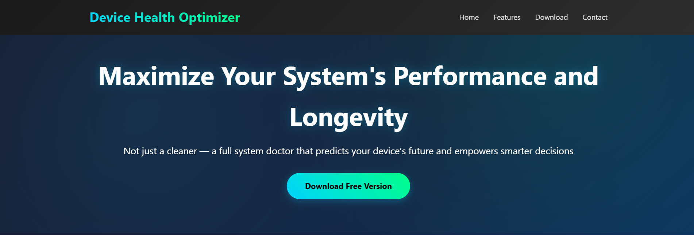
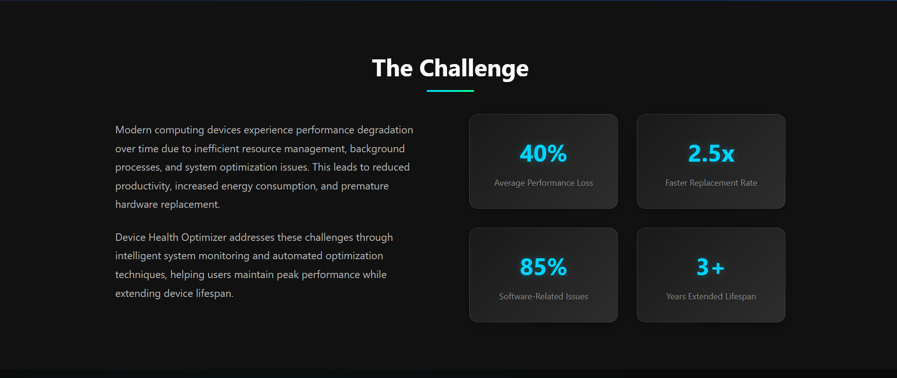
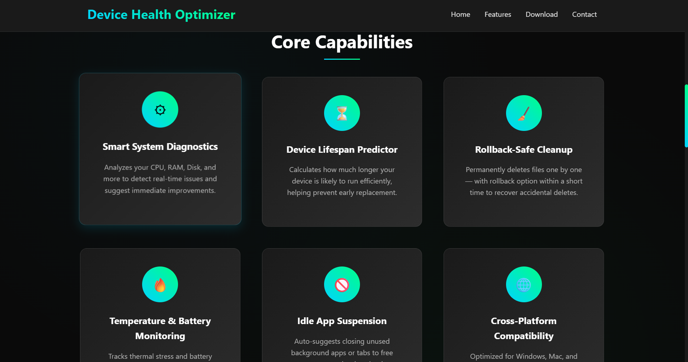
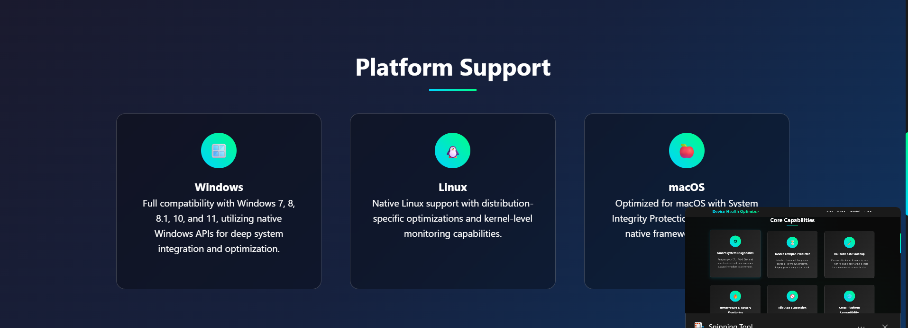
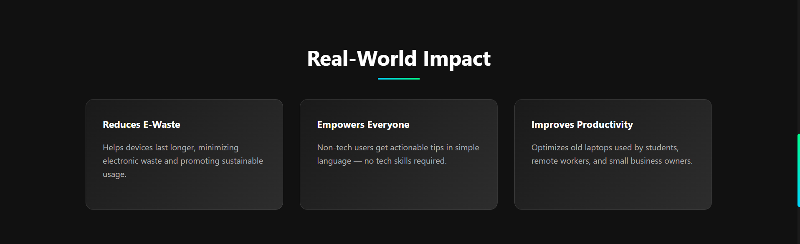
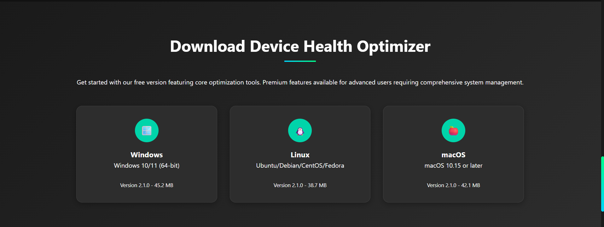
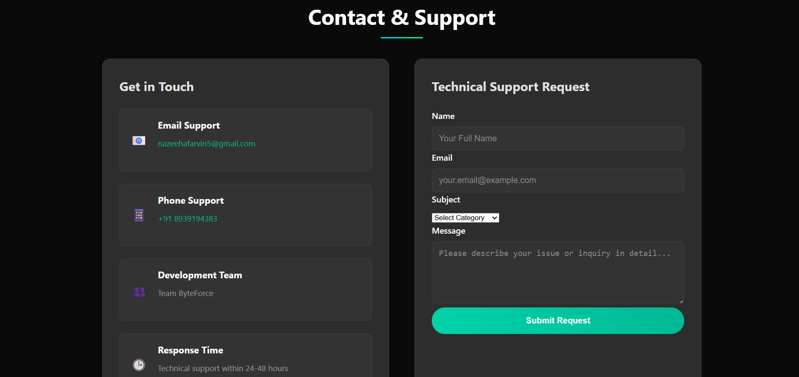

Welcome to the **Device Health Optimizer** landing page repository. This project introduces our cross-platform diagnostic tool that helps users monitor, understand, and maintain their device’s health and lifespan.

Modern computers lose performance over time due to background processes, inefficient resource usage, and thermal stress. **Device Health Optimizer** tackles this by:

- Smart diagnostics (CPU, RAM, Disk, Battery, Temperature)
- Device lifespan prediction
- Real-time actionable tips
- Safe cleanup (rollback option)
- Idle app suspension suggestions
- Sustainability focus (reduce e-waste)

This repository contains the **landing page** for the app.

📸 Screenshots

Here are some screenshots of the landing page:

