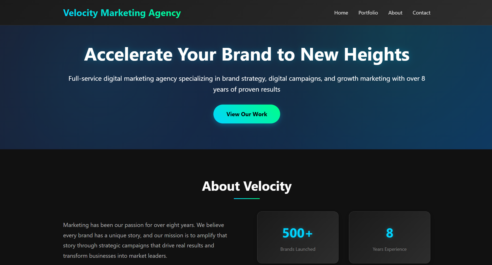
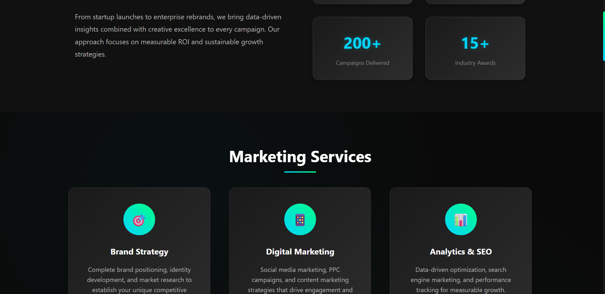
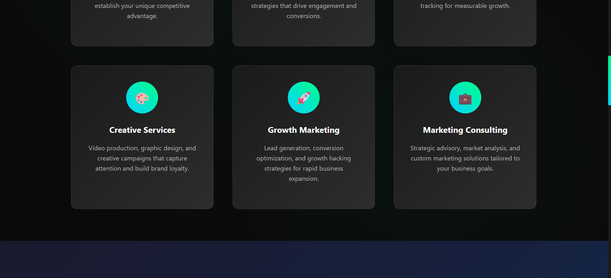
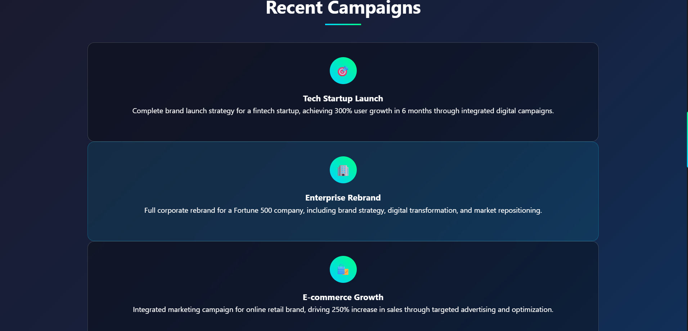
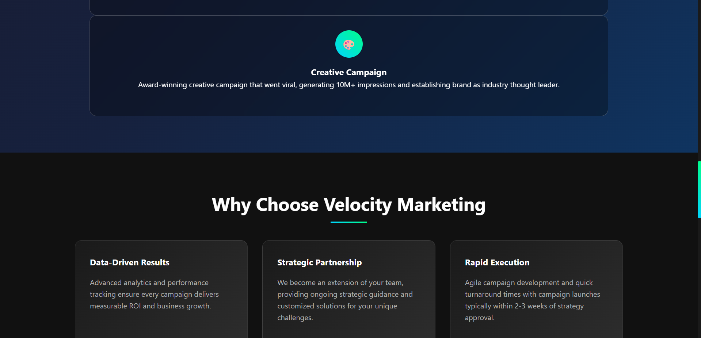
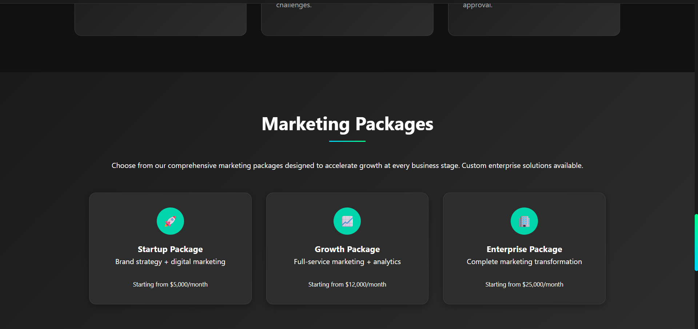
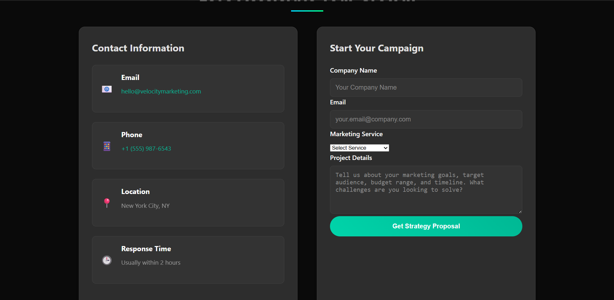

<<<<<<< HEAD
# 🌐 Velocity Marketing Agency - Student Web Project
=======
Welcome to the **Device Health Optimizer** landing page repository. This project introduces our cross-platform diagnostic tool that helps users monitor, understand, and maintain their device’s health and lifespan.

Modern computers lose performance over time due to background processes, inefficient resource usage, and thermal stress. **Device Health Optimizer** tackles this by:
>>>>>>> 5ca5fc127ed41cfbf2da578e8d382c51f0f51c75

This is a **dummy website project** created as part of my learning journey in web development. It's a fictional digital marketing agency site built using **HTML**, **CSS**, and basic **JavaScript** to demonstrate front-end design skills.

---

## 🛠️ Technologies Used

- **HTML5** – For structuring the web content
- **CSS3** – For styling and layout
- **JavaScript** – For basic interactivity (animations, effects)

---

## 📄 Project Overview

The website is a single-page layout that includes:

- ✅ A modern **Hero section**
- ✅ **About** section with animated statistics
- ✅ **Services** grid showcasing different offerings
- ✅ **Portfolio / Campaigns** section
- ✅ **Pricing/Packages** for businesses
- ✅ A simple **Contact Form**
- ✅ Fully **responsive layout** using CSS Flex/Grid

📸 Screenshots

Here are some screenshots of the landing page:
<<<<<<< HEAD

=======

>>>>>>> 5ca5fc127ed41cfbf2da578e8d382c51f0f51c75

